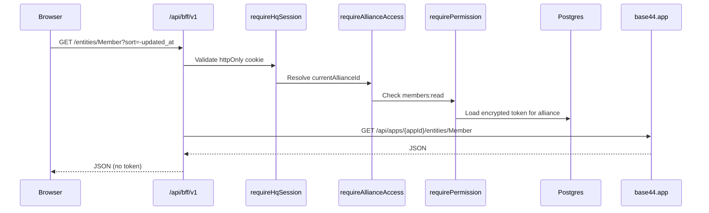

# BFF proxy specification

Design-only document for Phase 2+ implementation. The browser calls Alliance HQ only; HQ forwards to Base44 with the alliance's encrypted Ashed token attached server-side.

## Principles

1. **Deny by default** — only catalogued operations in [`ashed-api-catalog.json`](./ashed-api-catalog.json) may be proxied
2. **Never expose tokens** — no `authorization` header, JWT, or decrypted token in responses or error messages
3. **Alliance-scoped** — every request resolves alliance context before forwarding
4. **RBAC on every handler** — permission check before decrypt + forward
5. **Audit mutating calls** — POST, PUT, DELETE, and all server functions logged to `audit_log`

## Request flow



## Route layout

Base path: `/api/bff/v1`

Alliance context from session `current_alliance_id`. Optional future override: `X-Alliance-Slug` header for multi-tab switching (must still pass membership check).

| Route | Methods | Forwards to Base44 |
|-------|---------|-------------------|
| `/entities/[entity]/route.ts` | GET, POST | `GET\|POST /api/apps/{appId}/entities/{entity}` |
| `/entities/[entity]/[id]/route.ts` | GET, PUT, DELETE | `GET\|PUT\|DELETE /api/apps/{appId}/entities/{entity}/{id}` |
| `/functions/[name]/route.ts` | POST | `POST /api/apps/{appId}/functions/{name}` |
| `/integration/[action]/route.ts` | POST | `POST /api/apps/{appId}/integration-endpoints/{action}` |

Integration `action` uses double-dash encoding in the URL path:

- `Core/UploadFile` → `/api/bff/v1/integration/Core--UploadFile`
- `Core/ExtractDataFromUploadedFile` → `/api/bff/v1/integration/Core--ExtractDataFromUploadedFile`
- `Core/InvokeLLM` → `/api/bff/v1/integration/Core--InvokeLLM`

### Query string passthrough

Forward query strings unchanged for entity list reads (`?sort=`, filters). Capture exact params per entity from HAR during first implementation; document in catalog if new params appear.

### Request body passthrough

For POST/PUT and functions: forward JSON body unchanged after RBAC check. For integration uploads: stream multipart through with size limits (see below).

## Middleware chain

Every handler runs in order:

```typescript
async function bffHandler(req) {
  const session = await requireHqSession();           // 401 if missing
  const alliance = await requireAllianceAccess(session); // 403 if no membership
  const operation = resolveCatalogOperation(req);     // 404 if not in catalog
  await requirePermission(alliance, session, operation.permission); // 403
  const token = await getAllianceToken(alliance.id);  // 503 if not connected
  const result = await forwardToBase44(token, operation, req);
  if (operation.isMutating) await auditLog(...);
  return sanitizeResponse(result);
}
```

### `resolveCatalogOperation`

Lookup in [`ashed-api-catalog.json`](./ashed-api-catalog.json):

- Entity + method → `rbac.operationMap` entry
- Unknown entity or method → **404** (deny by default)
- Function name not in catalog → **404**
- Integration action not in catalog → **404**

### Permission mapping

| HTTP | Permission field |
|------|------------------|
| GET | `permissions.read` |
| POST, PUT, DELETE | `permissions.write` |

Destructive functions (`bulkDeleteByDate`, `bulkMoveByDate`) require `data:bulk_delete` / `data:bulk_move` regardless of HTTP method (always POST).

## Response sanitization

- Strip any `authorization`, `token`, or `set-cookie` from upstream headers
- Redact JWT-like strings in error bodies before returning
- Map Base44 401/403 to generic "upstream unauthorized" without token details
- Never log decrypted tokens

## Rate limiting

Per alliance + endpoint class:

| Class | Suggested limit |
|-------|-----------------|
| Entity reads | 120 req/min |
| Entity writes | 30 req/min |
| Functions (destructive) | 5 req/min |
| Integration uploads | 10 req/min |

Return `429` with `Retry-After` header.

## Upload / integration constraints

- Max body size: 50 MB default (configurable per action)
- Stream to Base44 without buffering entire file in memory when possible
- Timeout: 120s for OCR/LLM endpoints

## Client SDK (React pages)

HQ pages call BFF only:

```typescript
// Example — future client helper
const members = await fetch("/api/bff/v1/entities/Member?sort=-updated_at");
```

Expand [`KNOWN_ENTITIES`](../src/lib/base44/server.ts) to match full catalog at implementation time. Client code must not import `@base44/sdk` for alliance data.

## Out of scope (low priority)

These appear in HAR but are **not** proxied in initial phases:

- `POST .../analytics/track/batch` — telemetry
- `POST .../app-logs/.../log-user-in-app/*` — page analytics
- `GET .../public-settings/by-id/{appId}` — may remain direct fetch (no auth)

## Error codes

| Status | Meaning |
|--------|---------|
| 401 | No HQ session |
| 403 | No alliance access or missing permission |
| 404 | Operation not in catalog (deny by default) |
| 429 | Rate limited |
| 503 | Alliance has no connected Ashed token |
| 502 | Base44 upstream error (sanitized body) |

## Phase rollout

| Phase | Scope |
|-------|-------|
| 2 | Read-only GET for `Member`, `VSScore` |
| 3 | Integration proxy (video upload + Data Management OCR) |
| 4 | Mutations + destructive ops with audit |
| 5 | Retire Ashed iframes for migrated pages |

## Implementation touchpoints

- Token decrypt: [`src/lib/crypto/encrypt.ts`](../src/lib/crypto/encrypt.ts)
- Base44 client: [`src/lib/base44/server.ts`](../src/lib/base44/server.ts)
- Session: [`src/lib/session/index.ts`](../src/lib/session/index.ts)
- Catalog allowlist: [`docs/ashed-api-catalog.json`](./ashed-api-catalog.json)
