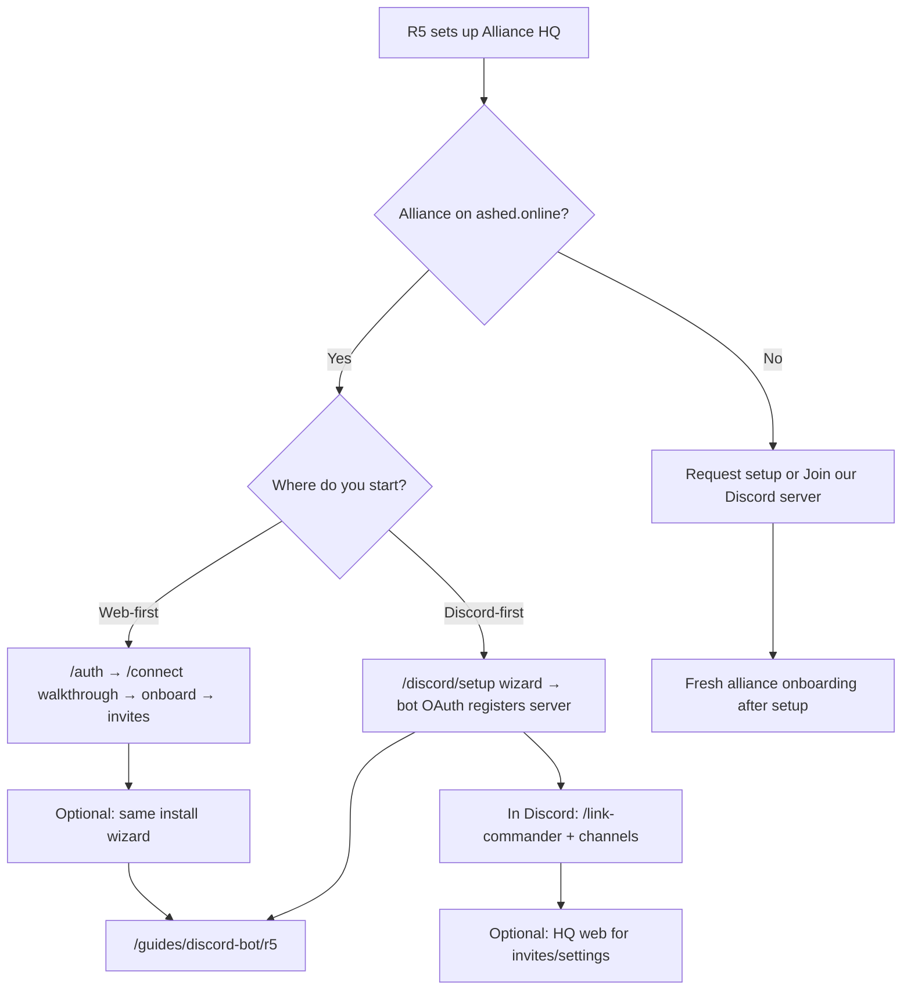
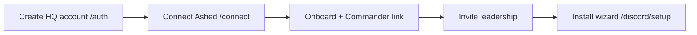
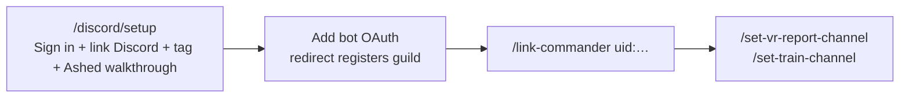

# Getting started — R5

For **R5 (alliance owner)** setting up Alliance HQ for the first time.

Alliance HQ is built for R4+ who want a well run alliance without spreadsheets. **Only your R5** can complete first-time setup that binds your tag to HQ and Discord. This guide shows two self-service paths when your alliance is on **ashed.online**, plus what to do if you are not importing from Ashed yet.

If your alliance uses **ashed.online**, connect Ashed early (web or Discord). That imports your alliance and roster and keeps HQ in sync. You can add Discord later, or do everything from Discord.

## Choose your path

**Web-first:** best at a computer; [Connect Ashed](/connect) then onboard and invites; add Discord via the same [install wizard](/discord/setup).

**Discord-first:** start at [Discord bot setup](/guides/discord-bot/r5) → [install wizard](/discord/setup) — one browser flow through bot OAuth; finish in Discord with **`/link-commander`**.

## Web-first sequence

1. [Create an HQ account](/auth).
2. [Connect Ashed](/connect) — on-page walkthrough.
3. Pick your alliance.
4. Complete onboard with your Commander.
5. Invite leadership under Team access.
6. [Install the Discord bot](/discord/setup) — tag pre-filled when signed in.

## Discord-first sequence

1. Open [Discord bot setup — install](/guides/discord-bot/r5/install-bot) → [install wizard](/discord/setup).
2. Sign in or create your HQ account.
3. Link your Discord account.
4. Enter your **alliance tag** if it is not already set.
5. Connect Ashed using the on-page walkthrough (recommended).
6. Click **Add bot to Discord** — when Discord sends you back, your server is registered automatically.
7. In Discord, run **`/link-commander uid:…`**.
8. Set VR and train channels.

## Without importing from Ashed

Your alliance can use HQ with or without importing from ashed.online. In the [install wizard](/discord/setup), choose **Skip Ashed import for now**, then submit your alliance name and state server. A platform maintainer will review your request; click **Check again** when ready, then **Continue** to add the bot. If you need help sooner, [Join our Discord server](https://discord.gg/pur2Uah2s). After setup, follow [Fresh alliance onboarding](/guides/alliance-onboarding/fresh-native).

## What's next

- [Link your members](/guides/alliance-onboarding)
- [Discord bot setup](/guides/discord-bot/r5)
- [Train operator guide](/guides/discord-train)

## Recovery (slash commands)

If you added the bot before the install wizard existed, you can still finish setup from Discord:

- **`/link`** — sign your Discord account into HQ
- **`/link-ashed tag:YourTag`** — connect Ashed credentials (opens a browser walkthrough)
- **`/link-alliance tag:YourTag`** — manually register this Discord server

The [install wizard](/discord/setup) is the recommended path for new setups.
