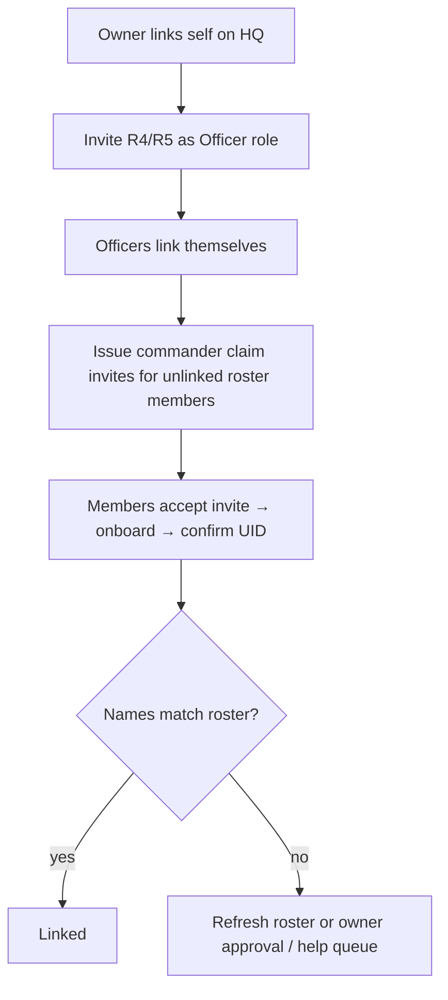

# Ashed-sync alliance — linking members on HQ

> **TODO:** Translate to Portuguese (`pt-BR`) when operator docs are localized.  
> **Audience:** alliance **owners** and **officers** on alliances that use Ashed for roster sync (`operatingMode: ashed`).  
> **Goal:** every in-game commander has an HQ account **bound** to the correct roster row.

---

## What you are solving

Ashed (or roster sync) gives Alliance HQ a **mirror** of your in-game roster in the **Members** list. That mirror is **not** the same as members being able to sign in:

| Already true after sync | Still needed |
| --- | --- |
| Roster names and ranks in HQ | Each player creates an HQ sign-in |
| Often ~100 rows for a full alliance | Each player **links** their HQ user to **their** commander row |
| Names may lag renames in Last War | Officers distribute invites and resolve mismatches |

An invite grants **access and permissions** (RBAC). **Linking** (on `/onboard`) ties that HQ user to one commander on the roster.

---

## Before you start

1. **Owner** connects Ashed (Settings or connect flow) so roster sync runs.
2. **Owner** completes **member link** for their own commander (UID confirm on `/onboard`).
3. **Game server** is linked on the alliance (required before officer/member invites from team settings).

Refresh the roster from Ashed if names look stale (Members page refresh / sync tools).

---

## Recommended rollout

### Step 1 — Owner links first

The owner must finish `/onboard` so HQ knows which commander they are. Without this, server adoption and officer tooling are harder to reason about.

### Step 2 — Invite officers (RBAC, not claim)

From **Settings → Team access**, invite your R4/R5 with role **Officer** (email or protected link + passphrase).

- This is **not** a commander claim invite — it grants officer permissions.
- Each officer still completes **member link** after accepting.

### Step 3 — Commander claim invites for everyone else

For each roster member who does **not** yet have HQ:

1. Open **Settings → Team access → Commander claim** (or a commander’s profile → generate claim invite).
2. Select the **commander name** from the unlinked roster list (single or bulk).
3. Send the **link + passphrase** to that player privately.

Claim invites are **member** role invites bound to a specific roster commander. The player confirms with their **player UID**; HQ never shows UID to officers in lists.

**Why claim instead of a generic member invite?**

- You already know which roster row they are.
- Reduces wrong-character links when many names look similar.
- Blocks the invitee from self-serving a different commander while the claim is pending.

### Step 4 — Generic member invite or join code (optional)

Use a **generic member invite** or **join code** when:

- You are broadcasting “everyone join HQ” without picking names one-by-one first.
- You do not know which roster row matches a person yet.

Invitees still land on `/onboard` and prove identity with UID. Prefer claim invites once the roster is stable and names are known.

---

## When names do not match

Last War names change. The roster may still show an old name. UID lookup uses the **current game name**, not the stale roster string.

| Symptom | What to do |
| --- | --- |
| Player’s game name ≠ any roster name | Refresh roster from Ashed; retry link |
| Still no exact match after refresh | Player uses **Ask an officer** from onboarding, or owner handles **roster link request** if invite-gated |
| Officer issued claim for wrong commander | Revoke / re-issue claim invite for the correct roster member |

HQ matches roster rows with **exact** names (current + previous names) — not fuzzy guessing.

---

## Full roster (~100 members)

Last War alliances cap at **100 in-game members**. When your roster is full:

- You are **not** adding new commanders to the game via HQ.
- You are **linking HQ accounts** to existing roster slots.
- Use **commander claim invites** for unlinked members; avoid handing out generic member invites to people who are not on the roster.

Officer, viewer, and data_entry invites are still valid when you need different **HQ permissions** — claim invites only cover the **member** role.

---

## Quick reference

| Task | Where | Invite type |
| --- | --- | --- |
| Grant officer permissions | Team access → invite | Officer role, no claim target |
| Link a known unclaimed commander | Team access → Commander claim | Member + bound commander |
| Broadcast “join HQ” | Team access → invite or join code | Member, no target |
| Break-glass unlink wrong link | Commander profile (owner / maintainer) | — |

---

## See also

- [Fresh native alliance onboarding](./fresh-native-alliance-onboarding.md) — no Ashed roster on day one
- [Discord bot help](/guides/discord-bot) — parallel Discord `/link-commander` path
