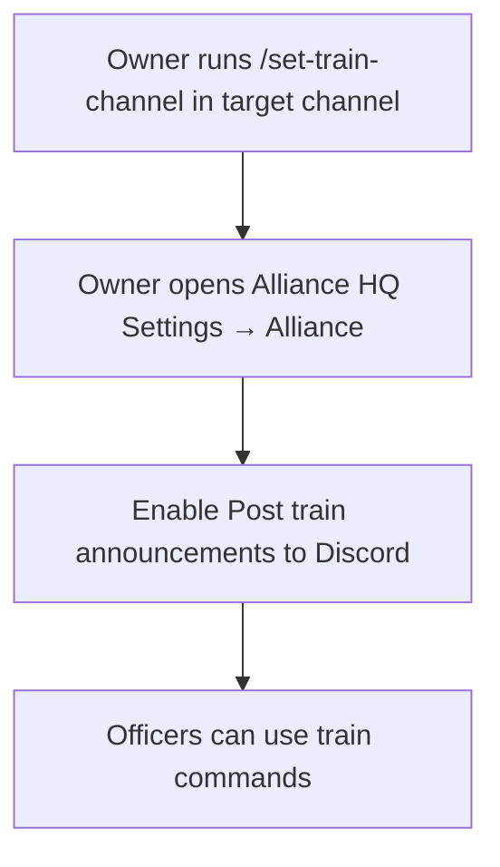
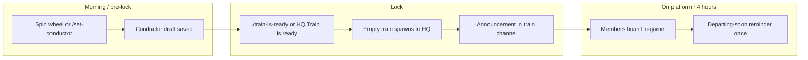

# Discord train bot — operator guide

> **TODO:** Translate this guide to Portuguese (`pt-BR`) and wire locale routing when we localize operator docs.

Alliance HQ can announce your alliance train conductor in Discord: who is conducting today, when the train is locked and on the platform, and a reminder before departure.

This guide is for **alliance owners** (setup) and **officers** (day-to-day conductor workflow). Members can check who is conducting with `/who-is-conductor`.

---

## Before you start

Your Discord server must already use the Alliance HQ bot for VR:

1. Owner: `/link-to-ashed-seat` → `/link` → `/link-alliance tag:YourTag`
2. Members: `/link` → `/link-commander`
3. Owner: `/set-vr-report-channel` (optional; unrelated to trains but common setup)

Train announcements are **opt in** and **off by default**.

---

## One-time setup (owner)

| Step | Who | Action |
|------|-----|--------|
| 1 | Owner | In the channel where members should see train posts, run **`/set-train-channel`** |
| 2 | Owner | In Alliance HQ, open **Settings → Alliance settings** for your tag |
| 3 | Owner | Turn on **Post train announcements to Discord** |

Until both the channel and the HQ toggle are set, lock/ready actions will **not** post publicly (officers still get ephemeral command replies).

---

## Daily train lifecycle

Game server calendar uses **UTC−2** (Last War server time). Alliance HQ follows that calendar for “today’s train.”

### Officer workflow (Discord)

| Command | What it does |
|---------|----------------|
| `/set-conductor name:…` | Pick a roster member as **draft** conductor for today (or `date:YYYY-MM-DD`). Confirm with the buttons the bot shows. Does **not** announce yet. |
| `/who-is-conductor` | Show conductor, VIP if set, and whether the day is draft or locked. |
| `/train-is-ready` | **Lock** the conductor for today, spawn the train in HQ, and post to the train channel (when announcements are enabled). |

### Officer workflow (Alliance HQ web)

On the **Trains** page, when Discord announcements are configured, use **Train is ready** instead of a plain lock. It locks the conductor and triggers the same channel post as `/train-is-ready`.

---

## User stories

### Story A — Officer picks after the wheel

> “We spun the wheel in HQ but I want to confirm in Discord before everyone sees it.”

1. Officer runs `/set-conductor name:ExactName` (or picks from fuzzy buttons).
2. Officer taps **Yes** to save the draft.
3. Officer runs `/train-is-ready` when satisfied → public announcement.

### Story B — Fast lock from Discord

> “Conductor was already picked in HQ; I only need to announce.”

1. Officer runs `/who-is-conductor` to verify the draft.
2. Officer runs `/train-is-ready` → lock + announce.

### Story C — Member checks conductor

> “Who is conducting today?”

1. Member runs `/who-is-conductor` (ephemeral reply).

### Story D — Owner enables announcements for a new season

1. Owner runs `/set-train-channel` in `#alliance-trains`.
2. Owner enables the toggle under Alliance settings.
3. Officers use `/train-is-ready` or HQ **Train is ready** each day.

---

## What gets posted

**Train is ready** (on lock):

> Today's train conductor (YYYY-MM-DD): **Name**  
> VIP: **Name** (if set)  
> The train is on the platform.

**Departing soon** (automatic, about one hour before the platform window ends):

> Reminder: **Name**'s train (YYYY-MM-DD) departs soon. Last chance to board.

Posts include a link to the HQ Trains page when `NEXT_PUBLIC_APP_URL` is configured.

---

## Permissions and restrictions

| Action | Who can do it |
|--------|----------------|
| `/set-train-channel` | Alliance **owner** only |
| Enable HQ announcement toggle | Alliance **owner** or **maintainer** (`trains:write` on web) |
| `/set-conductor`, `/train-is-ready` | **Officer** — alliance owner or linked **R4+** commander (same gate as `/vr-report`) |
| `/who-is-conductor` | Anyone in a **registered** Discord server for the alliance |
| Change conductor after lock | **Not via Discord** — use Alliance HQ; platform maintainers can unlock in HQ only |
| Cross-alliance commands | **Not supported** — tenant is resolved from **guild registration**, never from a tag you type on train commands |

**Other limits:**

- Announcements require bot token + channel + HQ toggle; missing any piece fails silently (no post).
- `/set-conductor` cannot override a **locked** day; unlock is HQ-only.
- Departing-soon fires **once per day per guild** after the train has been locked ~3 hours (within the 4-hour on-platform window).
- Native alliances (no Ashed) still work for **manual** conductor picks; auto VS/donation rolls may need Ashed or manual paths in HQ.

---

## Troubleshooting

| Symptom | Check |
|---------|--------|
| No public posts | `/set-train-channel` run? HQ toggle on? |
| “Not officer” | Link commander with `/link-commander`; need R4+ on roster or owner |
| “Guild not registered” | Owner must run `/link-alliance` |
| Fuzzy name mismatch | Use exact roster spelling or pick from buttons |
| Lock fails | Run `/who-is-conductor` — need a draft conductor first |

---

## Command reference

| Command | Options |
|---------|---------|
| `/set-train-channel` | — (uses current channel) |
| `/who-is-conductor` | optional `date` |
| `/set-conductor` | required `name`, optional `date` |
| `/train-is-ready` | optional `date` |

Re-register slash commands after deploy: `npm run discord:register-commands`
