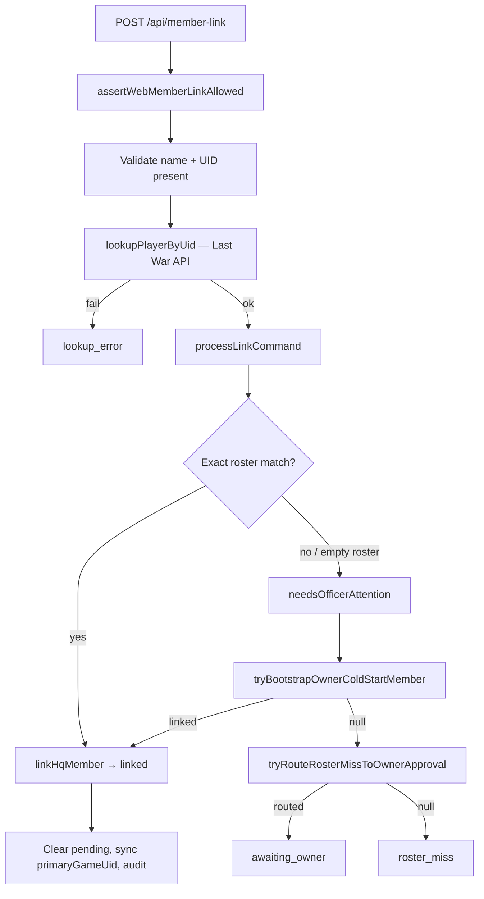
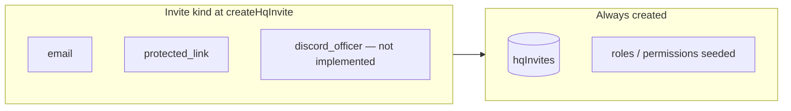

# Native alliance onboarding — flow reference

> **Audience:** platform maintainers, testers, and engineers debugging the native-alliance path (`operatingMode: native`).  
> **Scope:** provision → invite → accept → `/onboard` member link → post-link team growth.  
> Ashed connect is **optional** for native alliances; HQ RBAC comes from the invite, not Ashed.

**Operator guides (alliance owners/officers):**

- Hub: `/guides/alliance-onboarding`
- [Ashed-sync — linking a full roster](./ashed-alliance-member-onboarding.md)
- [Fresh native — owner-only cold start](./fresh-native-alliance-onboarding.md)

Agent rule: [`.cursor/rules/native-alliance-invites-rbac.mdc`](../.cursor/rules/native-alliance-invites-rbac.mdc)

---

## End-to-end flow

One linear path for every invitee. Invite **kind** (email vs protected link vs join code) only changes how the invitee authenticates and what rows are written at invite creation — not the shape of the diagram below.

```mermaid
flowchart TD
  subgraph provision["1 — Platform maintainer provisions alliance"]
    P1[POST /api/admin/native-alliances] --> P2[createNativeAlliance]
    P2 --> P3[(alliances row<br/>operatingMode: native)]
    P3 --> P4{ownerEmail provided?}
    P4 -->|yes| P5[(hqUsers + manual membership)]
    P4 -->|no| P6[Alliance only — no owner user yet]
  end

  subgraph invite["2 — Generate invite"]
    I1[POST .../invites<br/>PA or team settings] --> I2[createHqInvite]
    I2 --> I7[(hqInvites row + token)]
  end

  subgraph accept["3 — Invitee accepts"]
    A1[/invite/token page] --> A2{Signed in?}
    A2 -->|no| A3[/auth → callback to invite]
    A2 -->|yes| A4[POST /api/invite/token/accept]
    A4 --> A5[acceptHqInvite]
    A5 --> A6[provisionAllianceMembership]
    A6 --> A7[(RBAC membership + session alliance)]
    A7 --> A8[Redirect /onboard?next=destination]
  end

  subgraph onboard["4 — Member link wizard"]
    O1[/onboard page] --> O2{Already linked?}
    O2 -->|yes| O3[Redirect to next destination]
    O2 -->|no| O4[MemberLinkOnboardingWizard]
    O4 --> O5[Submit name + UID]
    O5 --> O6[POST /api/member-link]
    O6 --> O7[Last War lookup by UID]
    O7 -->|fail| O8[lookup_error]
    O7 -->|ok| O9[processLinkCommand]
  end

  subgraph link["5 — Link resolution"]
    O9 --> L1{Roster match?}
    L1 -->|exact match| L2[linkHqMember → linked]
    L1 -->|miss / empty roster| L3[needsOfficerAttention]
    L3 --> L4[tryBootstrapOwnerColdStartMember]
    L4 -->|owner + empty native roster| L5[Adopt server if missing<br/>create allianceMembers<br/>linkHqMember]
    L5 --> L2
    L4 -->|not cold-start| L6[tryRouteRosterMissToOwnerApproval]
    L6 --> L7[awaiting_owner + email to owner]
    L7 --> L8[Owner accepts via token link]
    L8 --> L2
    L6 -->|no invite / server gate| L9[roster_miss UI]
  end

  subgraph done["6 — Post-link"]
    L2 --> D1[Success → redirect /members default]
    D1 --> D2[Owner/PA can issue officer/member invites]
    D2 --> D3[Join codes optional]
    D3 --> D4[New invitees repeat accept → onboard]
  end

  provision --> invite
  invite --> accept
  accept --> onboard
  onboard --> link
  link --> done
```

---

## Step-by-step narrative

### 1. Provision native alliance (platform maintainer)

| | |
|---|---|
| **API** | `POST /api/admin/native-alliances` |
| **Gate** | `requirePlatformMaintainer` |
| **Function** | `createNativeAlliance` — `src/lib/native-alliance/provision.ts` |

Creates an `alliances` row with `operatingMode: "native"`, no Ashed credential, unique `slug`, and optional `ownerEmail`.

If `ownerEmail` is set, HQ also creates or reuses an `hqUsers` row and calls `assignManualMembership` with `ownerRole` (default `owner`). If no email, the alliance exists with no linked owner user until someone accepts an owner invite.

**No game server** is set at provision time. Server adoption happens when the owner completes member link (step 5).

---

### 2. Generate invite

| Caller | Route | Who can invite |
|--------|-------|----------------|
| Platform maintainer | `POST /api/admin/native-alliances/[allianceId]/invites` | Any role including `owner` |
| Owner / officer (post-link) | `POST /api/settings/team/invites` | Officer/member roles only — **not** `owner` |

**Function:** `createHqInvite` — `src/lib/native-alliance/invites.ts`

Common behavior for all kinds:

1. Seed system role + permissions (`ensureSystemRoleSeeded`).
2. Verify alliance exists.
3. Generate token (32-byte, SHA-256 hash stored) with **14-day TTL**.
4. Insert **`hqInvites`** row; return `inviteUrl` → `/invite/<token>?next=<safe path>`.

Invite and join-code creation **does not** require `alliances.game_server_id`. State-server matching happens at **member-link** time (`wrong_server`, owner cold-start server adoption).

See [Invite kinds & records](#invite-kinds--records-created) below for per-kind differences.

---

### 3. Accept invite

| | |
|---|---|
| **Preview** | `GET /api/invite/[token]` → `loadHqInvitePreview` |
| **Accept** | `POST /api/invite/[token]/accept` → `acceptHqInvite` |
| **UI** | `src/components/native-alliance/InviteAcceptClient.tsx` |

**Gates:**

- Invitee must be signed in (`auth_required` / 401).
- Invite not expired, not already used (with rebind for same user on re-open).
- **Email kind:** session email must match invite email (`email_mismatch`).
- **Protected link kind:** correct passphrase, not already consumed.

**On success — `provisionAllianceMembership`:**

| Record | Change |
|--------|--------|
| `hqInvites` | `acceptedAt`, `acceptedByHqUserId` set |
| `ashedCredentials` | Cleared for session (fresh alliance context) |
| RBAC | `grantHqAccess` + `assignManualMembership` |
| `alliances` | If role is `owner`: `ownerHqUserId`, `ownerEmail` updated |
| `sessions` | `hqUserId`, `currentAllianceId`, `allianceTag`, `allianceId`, `userLabel` |

**Redirect:** always via `/onboard` first:

```
/onboard?next=<destination>
```

Destination = sanitized `?next` query param, else invite `redirectPath`, else `/members` (`DEFAULT_POST_INVITE_APP_PATH`).

---

### 4. `/onboard` member link wizard

| | |
|---|---|
| **Page** | `src/app/[locale]/(connect-flow)/onboard/page.tsx` |
| **Wizard** | `src/components/onboarding/MemberLinkOnboardingWizard.tsx` |

**Entry gates:**

- Authenticated session with app access.
- Session has `currentAllianceId` / `allianceId`.
- If `sessionHasHqMemberLink` → skip wizard, redirect to `next`.

**Wizard phases:** `welcome` → `form` (name + UID) → outcomes below. Optional `walkthrough`, `fuzzy`, `connect_ashed` (legacy UI; Ashed gate currently disabled in code).

**Submit:** `POST /api/member-link` with `{ reportedName, gameUid }`.

---

### 5. Member link orchestrator

**Function:** `runWebMemberLinkSubmit` — `src/lib/member-link/orchestrator.server.ts`



#### 5a. Leadership cold-start bootstrap (owner or officer)

**Function:** `tryBootstrapOwnerColdStartMember` — `src/lib/member-link/roster-link-request.server.ts`

Runs only when **all** of:

- Native alliance (`isNativeAlliance`)
- Empty roster (`rosterCount === 0`)
- Leadership gate: `alliances.ownerHqUserId` matches **or** accepted invite with `owner` or `officer` role
- `namesMatch(reportedName, lookup.gameUserName)` — case-insensitive, whitespace-normalized

Then:

1. Require `lookup.gameServerNumber` → else `wrong_server`.
2. If alliance has **no** server → `linkAllianceToGameServer` + `applySeasonSync` (PR #70).
3. If alliance **has** server → must match player's server → else `wrong_server`.
4. Insert **`allianceMembers`** row (synthetic `ashedAllianceId`).
5. `linkHqMember` → **`hqMemberLinks`** → else `member_taken`.
6. Audit: `member_link.owner_cold_start_bootstrap`.

#### 5b. Roster miss → owner approval

**Function:** `tryRouteRosterMissToOwnerApproval`

When bootstrap returns `null` (non-owner, roster not empty, name mismatch, etc.) but invitee has an accepted `email` / `protected_link` invite:

1. Server gate must pass (alliance server linked and matches player).
2. Creates **`hqRosterLinkRequests`** (pending) + **`hqRosterLinkActionTokens`** (accept/reject, 7-day TTL).
3. Saves pending `{ kind: link_awaiting_owner }`; emails owner approve/reject links.
4. Owner action via `processRosterLinkActionToken` → accept creates member + link, reject clears pending.

Wizard polls `GET /api/member-link` every 30s while `awaiting_owner`.

#### 5c. Direct roster match

When `processLinkCommand` finds an exact name match on the roster, `finalizeCommandResult` → `persistHqLinkTarget` → `linkHqMember` without owner approval.

---

### 6. Post-link — growing the alliance

After the owner (or any member) has an **`hqMemberLinks`** row:

| Action | Route | Gate |
|--------|-------|------|
| Officer/member invite | `POST /api/settings/team/invites` | Linked game server; role assignable by inviter; **no owner invites** from team UI |
| Join code | `POST /api/settings/team/join-codes` | Linked game server |
| Join code redeem | `POST /api/join-codes/redeem` | Auth required → same `/onboard` redirect |

Each new invitee repeats **accept → `/onboard` → member link**. With only the owner on roster, officers/members typically land in **`awaiting_owner`** until the owner approves their roster link request.

**Platform maintainer escape hatch:** `PATCH /api/admin/alliances/[allianceId]/game-server` — inline edit in Admin Alliances console for native alliances only.

---

## Invite kinds & records created

The main flowchart does not branch on invite kind. Differences are limited to **creation-time assets** and **accept-time validation**.



| Kind | Created at invite time | Accept validation | Plaintext returned once |
|------|------------------------|-------------------|-------------------------|
| **`email`** | `hqInvites` with `email` set, `passphraseHash: null` | Session email must match invite email | Invite URL only |
| **`protected_link`** | `hqInvites` with `passphraseHash`, `email: null` | Correct passphrase; `passphraseConsumedAt` set on accept | Invite URL **+ passphrase** |
| **`discord_officer`** | — | Throws *"Discord officer invites require Auth Phase 2."* | — |

**`hqInvites` row fields (all kinds):** `id`, `allianceId`, `kind`, `roleId`, `tokenHash`, `adminLabel`, `targetDiscordUserId`, `requireMemberLink`, `invitedByHqUserId`, `redirectPath`, `expiresAt`, `createdAt`.

**On accept (all kinds):** same `provisionAllianceMembership` outcome — RBAC membership + session alliance binding. Member link is still required at `/onboard` unless already linked.

---

## Join codes (parallel entry path)

Join codes skip the invite URL but converge on the same `/onboard` member-link step.

| Step | Function | Records |
|------|----------|---------|
| Create | `createAllianceJoinCode` | `hqAllianceJoinCodes` (`codeHash`, `codeHint`, `maxRedemptions`, TTL default 7 days). Plaintext `TAG-XXXXXX` returned once. Requires linked game server. |
| Redeem | `redeemAllianceJoinCode` | `hqAllianceJoinCodeRedemptions`, `provisionAllianceMembership`, redirect `/onboard?next=/members` |

Join codes are available from PA admin panel and team settings after server is linked.

---

## Records created across the full journey

| Step | Tables written |
|------|----------------|
| Provision | `alliances`; optional `hqUsers` + manual membership |
| `createHqInvite` | `hqInvites`; role/permission seeds |
| Invite accept | `hqInvites` (accepted), `sessions`, RBAC membership; `alliances` owner fields if owner role |
| Owner cold-start link | `game_servers` link on `alliances`, `allianceMembers`, `hqMemberLinks`, `hqUsers.primaryGameUid` |
| Roster miss approval | `hqRosterLinkRequests`, `hqRosterLinkActionTokens`, inbox item; on accept → `allianceMembers`, `hqMemberLinks` |
| Normal roster match | `hqMemberLinks`, `hqUsers.primaryGameUid` |
| Join code create | `hqAllianceJoinCodes` |
| Join code redeem | `hqAllianceJoinCodeRedemptions` + same accept-side membership writes |

---

## Outcomes & common blockers

| Outcome / error | When | Tester note |
|-----------------|------|-------------|
| `name_mismatch` | Typed name ≠ Last War API name | **Retry on form** — use suggested name button |
| `confirm_server` | Lookup/alliance server missing or mismatched (owner cold-start) | Owner enters state server number |
| `lookup_fallback` | Last War API unreachable (owner cold-start) | Owner enters server; typed name trusted |
| `wrong_server` | Player UID server ≠ alliance server (or alliance has no server yet) | Owner sets server via cold-start / Game season; non-owners contact R5 |
| `lookup_error` | Invalid UID, player not found | UID format + spelling |
| `roster_miss` | No bootstrap, no owner-approval route | Ask officer / owner approval |
| `awaiting_owner` | Roster link request created | Owner must click email approve link |
| `member_taken` | UID/member already linked to another HQ user | **Admins notified** via `member_link_uid_taken` alert |
| `email_mismatch` | Email invite, wrong signed-in account | Sign in with invited email |
| `linked` | Success | Redirect to `/members` (or `next`) after ~1.8s |

See [native-alliance-onboarding-smoke-test.md](./native-alliance-onboarding-smoke-test.md) for manual verification steps.

---

## Recommended tester happy path

1. PA provisions native alliance (no server).
2. PA generates **owner** invite (`protected_link` or `email`).
3. Owner accepts → lands on `/onboard`.
4. Owner submits **exact** Last War name + UID.
5. Expect `linked` → `/members`; alliance now has state server.
6. PA or owner issues officer/member invites.
7. Each invitee: accept → `/onboard` → name+UID → **`awaiting_owner`** until owner approves (or exact roster match if already imported).

---

## Self-service member onboarding

By default, members who accept an invite or redeem a join code can link immediately after Last War verifies their player UID — on **Alliance HQ (`/onboard`)** or **Discord (`/link-commander`)**.

The verified Last War name is stored during the link. If no roster entry matches, Alliance HQ may create one and let the member in right away. Officers review those links on **Members → Onboarding review** — to confirm the roster entry or merge with an existing unlinked entry when HQ suggests a duplicate.

**Discord:** Self-service requires a linked HQ account plus invite/join-code proof. Discord-only users without HQ stay on the strict roster-link request path.

**Owner settings:** Settings → Member onboarding (`/settings/member-onboarding`).

**HQ roster cap (200):** JIT roster row creation is blocked at 200 active HQ roster rows (Last War in-game alliances cap at 100). Exact-match self-service links to unlinked rows still work below the HQ cap.

---

## Key source files

| Area | Path |
|------|------|
| Provision | `src/lib/native-alliance/provision.ts` |
| Invites | `src/lib/native-alliance/invites.ts` |
| Membership on accept | `src/lib/native-alliance/provision-membership.ts` |
| Join codes | `src/lib/native-alliance/join-codes.ts` |
| Onboard page | `src/app/[locale]/(connect-flow)/onboard/page.tsx` |
| Wizard | `src/components/onboarding/MemberLinkOnboardingWizard.tsx` |
| Member-link API | `src/app/api/member-link/route.ts` |
| Orchestrator | `src/lib/member-link/orchestrator.server.ts` |
| Cold-start + owner approval | `src/lib/member-link/roster-link-request.server.ts` |
| Link command | `src/lib/vr/link-command.ts` |
| Redirect helpers | `src/lib/navigation/safe-redirect.shared.ts` |
| Admin provision UI | `src/components/admin/AdminNativeAlliancePanel.tsx` |
| Team invites UI | `src/components/settings/TeamInvitePanel.tsx` |
