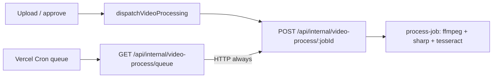

# Video external worker (Phase 2)

Alliance HQ can split **video OCR processing** onto a long-running host while keeping the main Next.js app on Vercel.

| Phase | Status |
| --- | --- |
| **0** — CI function-trace budgets | Shipped |
| **1** — Drop ffprobe, narrow tesseract LSTM tracing | Shipped (#222) |
| **2a** — Slim Vercel queue cron (this doc) | Queue always HTTP-dispatches; no OCR NFT on cron |
| **2b** — Dedicated worker host (Fly/Railway/Docker) | Not shipped — example URLs only |

Discord `/thp` and web My THP screenshot OCR stay on Vercel (out of Phase 2 video-worker scope).

## Architecture



| Surface | Role |
| --- | --- |
| `POST /api/internal/video-process/[jobId]` | Runs the full pipeline (`process-job`). **Fat** OCR endpoint. |
| `GET /api/internal/video-process/queue` | Pulls one `queued` job and **always** POSTs to `[jobId]` (same origin or `VIDEO_WORKER_BASE_URL`). Never imports `process-job` — slim NFT. |
| `scripts/workers/video-processor.mjs` | Optional long-running **DB poller** that POSTs the same `[jobId]` route (not a standalone OCR runtime). |

## Environment

| Variable | Purpose |
| --- | --- |
| `VIDEO_WORKER_SECRET` | Bearer token for worker ↔ app (`Authorization: Bearer …`). Required in production. |
| `VIDEO_WORKER_BASE_URL` | Base URL used for process/archive POSTs (no trailing slash). Unset → public app origin. |
| `CRON_SECRET` | Vercel Cron auth for the queue route (unchanged). |

### Single-host (default today)

Unset `VIDEO_WORKER_BASE_URL`, or set it equal to `NEXT_PUBLIC_APP_URL` / `VERCEL_URL`. Queue cron and upload triggers POST to the **same** deployment’s `[jobId]` route. Fat natives live only on that route (plus roster-import / reprocess / Discord·THP screenshot OCR).

### Split deploy (Phase 2b — not provisioned in-repo yet)

Point `VIDEO_WORKER_BASE_URL` at a **different** host (e.g. a future `https://video-worker.example`), while `NEXT_PUBLIC_APP_URL` remains the public app.

- Upload / approve / queue cron → POST worker host `[jobId]`.
- Worker host needs the same `VIDEO_WORKER_SECRET`, database, R2, and native stack (ffmpeg / sharp / tesseract).
- There is **no** Dockerfile / Fly / Railway config in this repo yet — treat example hostnames as placeholders.

## Sharp / libvips safety (#213)

Turbopack externalizes `sharp` app-wide. **Global** `outputFileTracingIncludes["*"]` ships libvips on every serverless route — do not remove when trimming OCR bundles. Prefer dynamic `import()` at feature boundaries (THP screenshot OCR) so unrelated routes stay lean.

## Local development

```bash
# Terminal 1 — Next app (default http://localhost:5175)
npm run dev

# Terminal 2 — optional backup poller (hits the same app [jobId] route)
VIDEO_WORKER_BASE_URL=http://localhost:5175 VIDEO_WORKER_SECRET=dev-secret \
  node scripts/workers/video-processor.mjs
```

## CI / bundle budgets

`npm run vercel:analyze-function-trace` (linux) after `npm run build`:

- **Queue** — ≤ ~120 MB, must include libvips, must **not** include `ffmpeg-static` / `tesseract.js*`
- **`[jobId]`** — ≤ 230 MB (full OCR stack)
- Discord / THP — `requireLibvips` guards

## Related

- `.env.example` — `VIDEO_WORKER_*` comments
- `scripts/vercel/video-ocr-file-tracing.mjs` — shared tracing includes/excludes + budgets
- `src/lib/video/video-process-dispatch.server.ts` — HTTP dispatch helper
- `src/lib/video/video-process-local.server.ts` — local `process-job` runner (worker `[jobId]` only)
