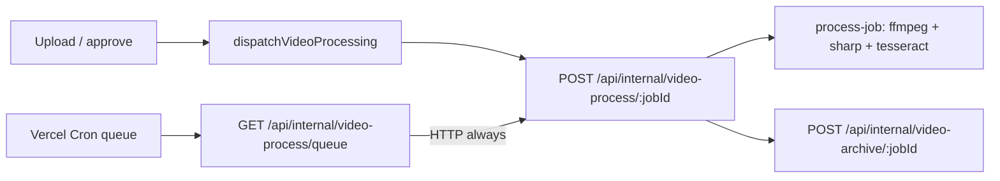

# Video external worker (Phase 2)

Alliance HQ can split **video OCR processing** onto a long-running host while keeping the main Next.js app on Vercel.

| Phase | Status |
| --- | --- |
| **0** — CI function-trace budgets | Shipped |
| **1** — Drop ffprobe, narrow tesseract LSTM tracing | Shipped (#222) |
| **2a** — Slim Vercel queue cron | Queue always HTTP-dispatches; no OCR NFT on cron (#255) |
| **2b** — Dedicated worker host | **Shipped in-repo** — `deploy/video-worker/` (Docker + Fly config) |

Discord `/thp` and web My THP screenshot OCR stay on Vercel (out of Phase 2 video-worker scope).

## Architecture



| Surface | Role |
| --- | --- |
| `POST /api/internal/video-process/[jobId]` | Full pipeline (`process-job`). **Fat** OCR endpoint — run on worker when split. |
| `POST /api/internal/video-archive/[jobId]` | Post-process archive — also fat; worker should own it when split. |
| `GET /api/internal/video-process/queue` | Vercel cron: pull one `queued` job and **always** POST `[jobId]`. Slim NFT. |
| `GET /api/internal/video-worker/health` | Unauthenticated liveness for Fly/compose. |
| `scripts/workers/video-processor.mjs` | Optional **DB poller** (`npm run video:worker`) — not the OCR runtime. |
| `deploy/video-worker/` | Dockerfile + compose + Fly config for the OCR host. |

When `VIDEO_WORKER_MODE=1`, middleware 404s everything except process/archive/health (so a public Fly URL is not a second HQ UI).

## Environment

| Variable | App (Vercel) | Worker host |
| --- | --- | --- |
| `VIDEO_WORKER_SECRET` | Required | Same value |
| `VIDEO_WORKER_BASE_URL` | Worker origin when split; unset = app origin | **Worker’s own public URL** (so archive stays local) |
| `NEXT_PUBLIC_APP_URL` | Public HQ | Public HQ (not the worker) |
| `DATABASE_URL` | Yes | Same DB (do not set `LOCAL_DATABASE_URL` on Fly) |
| `TOKEN_ENCRYPTION_KEY` | Yes | Same (Ashed session decrypt) |
| `AUTH_SECRET` | Yes | Yes (module init) |
| `R2_*` | Yes | Same bucket |
| `CRON_SECRET` | Yes (queue) | Not needed |
| `VIDEO_WORKER_MODE` | Unset | `1` (also at **worker image build** — middleware inlines it) |
| `VIDEO_WORKER_STANDALONE` | Unset | Build-only (`1` for `next build` → standalone) |

### Single-host (default)

Unset `VIDEO_WORKER_BASE_URL` (or equal to app origin). Queue and upload triggers POST the same deployment’s `[jobId]`.

### Split deploy (Phase 2b)

1. Deploy worker (`deploy/video-worker/README.md`).
2. Set Vercel `VIDEO_WORKER_BASE_URL` to the worker HTTPS origin (different host than `NEXT_PUBLIC_APP_URL`).
3. On the worker, set `VIDEO_WORKER_BASE_URL` to **itself** so `dispatchVideoArchive` does not bounce archive back to Vercel.

## Local smoke

```bash
# Worker on :5176
npm run video:worker:docker

curl -s http://localhost:5176/api/internal/video-worker/health

# App on :5175
VIDEO_WORKER_BASE_URL=http://localhost:5176 VIDEO_WORKER_SECRET=dev-secret npm run dev
```

Enqueue a video job; confirm the worker logs ffmpeg/OCR and the job reaches `review`.

## CI / bundle budgets

`npm run vercel:analyze-function-trace` (linux) after `npm run build`:

- **Queue** — ≤ ~120 MB; forbid `ffmpeg-static` / `tesseract.js*`
- **`[jobId]`** — ≤ 230 MB (full OCR stack; still present on Vercel as single-host fallback)
- Discord / THP — `requireLibvips` guards

## Sharp / libvips safety (#213)

Global `outputFileTracingIncludes["*"]` ships libvips on every Vercel route. Do not remove when trimming OCR. Prefer dynamic `import()` at feature boundaries (THP screenshot OCR).

## Related

- `deploy/video-worker/README.md` — Fly secrets + deploy commands
- `.env.example` — `VIDEO_WORKER_*` comments
- `scripts/vercel/video-ocr-file-tracing.mjs` — NFT includes/excludes + budgets
- `src/lib/video/video-process-dispatch.server.ts` — HTTP dispatch
- `src/lib/video/video-process-local.server.ts` — local `process-job` (worker `[jobId]`)
- `src/lib/video/video-worker-mode.shared.ts` — allowlist for `VIDEO_WORKER_MODE=1`
