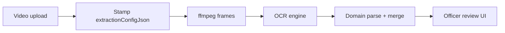

# Video pipeline configs and experiments

Platform-maintainer guide for **frame extraction** and **OCR** settings used by Alliance HQ video upload jobs. This page is English-only.

**Admin entry points**

| Surface | Path | What it controls |
|---------|------|------------------|
| Parse configs | `/admin/parse-configs` | Named JSON recipes (frame extraction **or** roster OCR) |
| Experiments | `/admin/experiments` | A/B traffic split across parse configs for a score target |
| Video jobs | `/admin/video-jobs` | Inspect frames, timings, duration, and OCR output per job |
| Analytics | `/admin/video-jobs/analytics` | Campaign / pass quality rollups |

Officers and uploaders do **not** pick fps or OCR settings. Density and OCR knobs are stamped onto each job when the upload is finalized (or when a roster experiment arm is assigned).

---

## Mental model



Two different JSON shapes share the same `parse_configs` table:

| Shape | `mode` | Used for | Admin form |
|-------|--------|----------|------------|
| **Extraction config** | `"scene"` or `"fps"` | Which frames to grab from the video | Built into `/admin/parse-configs` create form |
| **Roster OCR config** | `"roster-ocr"` | Tesseract preprocess + recognition for **member roster** | Created via API / JSON (same table); experiments target `member-roster-screenshot` |

Do not mix them: an extraction config does not change Tesseract settings, and a roster-OCR config does not change frame sampling.

---

## Frame extraction (all video score targets)

Default primary pass when nothing is assigned:

```json
{ "mode": "scene", "sceneThreshold": 0.25, "sampleFps": 1 }
```

| Field | Meaning |
|-------|---------|
| `mode: "scene"` | Keep a frame when ffmpeg thinks the picture changed enough |
| `sceneThreshold` | Lower = more sensitive = **more frames**. Typical range `0.05`–`0.35` |
| `sampleFps` | Used as the **fallback** when scene mode returns almost nothing, and as the rate when `mode: "fps"` |
| `mode: "fps"` | Sample at a fixed rate for the whole clip (ignores scene changes) |

### First and last frames

- Scene mode **forces an early frame** (~100 ms into the video). That is intentional so the top of a list is not skipped.
- There is **no forced last frame** today. If the last on-screen rows are missing, denser fps sampling usually helps; a code change would be required to always pin the final frame.

### How assignments apply

When an upload finishes enqueue (`finalize` / `activate`):

1. Look up **standing config assignment** for `(scoreTarget, boardKey)` — most specific wins: exact board → score target only → global. Else use the default primary pass above.
2. If an **active experiment** applies and traffic rolls in:
   - **Variant arm** (has a scene/fps parse config) → stamp that config onto the **primary** job officers review.
   - **Control arm** (`configId` null) → keep the standing assignment / default on primary.
   - Roster-ocr arm configs are **not** applied as primary frame extraction (those stay on the roster OCR / Tesseract path).
3. Store the chosen JSON on the primary job as `extractionConfigJson` (and a `passKey` label). Group gets `experimentCampaignId` / `experimentArmId` when assigned.

**Promote is not required** for an active experiment to change officer-facing OCR. Promote graduates a winner to the standing assignment for uploads outside experiment traffic (or after conclude).

**Reprocess uses the config already stamped on the job.** Changing `/admin/parse-configs` or promoting an experiment does **not** rewrite old jobs. To test a new recipe on an existing video: assign the config for new uploads, or re-upload / re-stamp (ops paths that re-finalize the job).

### Cost and latency

More frames ⇒ more OCR work ⇒ longer serverless / worker time and larger frame storage. Prefer **score-target-scoped** assignments (for example only `bank-deposit-slip-history`) over a global denser default so Desert Storm / VS boards stay cheap.

---

## OCR itself — what you can and cannot turn

### Member roster (`member-roster-screenshot`)

Admin **can** tune OCR via parse configs with `mode: "roster-ocr"` and experiments on that score target:

| Field | Effect |
|-------|--------|
| `preprocessScale` | Upscale before Tesseract (default `2`; try `3` for small UI text) |
| `tesseractPsm` | Tesseract page segmentation (default `6` = uniform block; `3` = sparse text) |
| `minWordConfidence` | Drop words below this confidence (default `40`; lower keeps more text, more noise) |
| `charWhitelist` | Optional character filter |

Wire those through `/admin/experiments` (or config assignment) for roster uploads. Approve / shadow paths stamp the roster OCR JSON onto the job.

### Bank Deposit Slip History (`bank-deposit-slip-history`)

Admin **cannot** change Tesseract settings from the UI today. Deposit-slip stills reuse the **hardcoded roster defaults** (`scale 2`, PSM `6`, min confidence `40`). Parse configs and experiments for this target only affect **frame extraction**.

Native OCR is always used for this target (no Ashed). Cross-frame merge partitions by exact normalized commander name, corroborates nearby or majority-agreeing timestamps (including OCR minute misreads), coalesces partial reads into one review row, and flags genuine amount/term/identity conflicts for officer resolution.

### Ashed scoreboards (Desert Storm, VS, …)

OCR quality is largely owned by the Ashed OCR service when Ashed is the engine. HQ parse configs still control **which frames** are sent. Alliance “HQ OCR only” and native-only targets are separate engine switches — not sensitivity knobs.

---

## Experiments vs production assignment

| Mechanism | When it applies | What it stamps |
|-----------|-----------------|----------------|
| **Config assignment** (`config_assignments`) | No active experiment traffic for this upload, or control arm | Primary job `passKey` + `extractionConfigJson` |
| **Active experiment arm** | Upload rolls into campaign (`trafficPercent` + arm `trafficWeight`) | Primary job uses **variant** arm parse config; **control** arm uses standing assignment / default |
| **Promote** | After conclude (or anytime) | Writes standing assignment for post-campaign default |

**Officers always review the primary job.** Ratings (`thumbs_up` / `thumbs_down`) and quality scores attach to that primary. Experiment arm analytics aggregate from primary jobs only.

| Goal | Use |
|------|-----|
| Compare two recipes safely | **Experiment** — control arm (standing default) + variant arm (denser fps / lower scene threshold); limited traffic percent |
| Make a winner the default for a target | **Promote** on the campaign detail page → writes a **config assignment** for that `scoreTarget` (+ optional `boardKey`) |
| Permanent default without A/B | Create parse config → assign via promote / config-assignments API for that score target |

Experiments are not ML training. They are traffic splits across named parse configs stamped onto the **primary** job officers experience.

### Shadow jobs

Extraction shadows (`passRole: "shadow"`, default `scene_0.1`) are for **engine / pass comparison**, not for A/B of experiment arm configs. Variant arm `configId` does **not** drive shadow extraction.

Roster video tandem OCR (Ashed primary vs Tesseract shadow) is a separate path (`tesseract_shadow` + `ocr_eval_snapshots`).

---

## Worked example: fast-scrolling Deposit Slip History

**Symptom.** Officers film the in-game Deposit Slip History list scrolling quickly. A ~24 s clip yields ~25 frames under the default scene pass (~1 fps). Review shows missing early rows and many incomplete rows (missing amount, term, time, etc.). Validation then blocks save until every field is filled by hand.

**Diagnosis.** Under-sampling, not “weak OCR sensitivity.” Rows that never appear in a captured frame cannot be recovered by Tesseract knobs (and deposit-slip has no admin OCR knobs anyway).

### Step 1 — Create denser extraction configs

In `/admin/parse-configs`, create one or both:

**Option A — fixed fps (recommended for steady scrolls)**

```json
{ "mode": "fps", "sampleFps": 4 }
```

Suggested pass key: `fps_4_deposit_slip`.

**Option B — more sensitive scene detect**

```json
{ "mode": "scene", "sceneThreshold": 0.1, "sampleFps": 2 }
```

Suggested pass key: `scene_0.1_deposit_slip`. Keep `sampleFps` as a fallback if scene returns too few frames.

Activate the config (status **active**).

### Step 2 — Scope to the score target

Do **not** set this as the global default. Scope to:

- Score target: `bank-deposit-slip-history`
- Board key: leave empty unless you intentionally split boards

### Step 3 — Prefer an experiment first

1. `/admin/experiments` → new campaign  
   - Score target: `bank-deposit-slip-history`  
   - Hypothesis: “4 fps reduces incomplete / missing rows vs scene 0.25 without blowing past OCR time budgets.”
2. Arms:
   - **Control** — standing default (no configId)
   - **Variant** — `fps_4_deposit_slip` (or scene_0.1)
3. Start with partial traffic (for example 20–50%) if volume is high, or 100% to temporarily A/B the whole target.
4. New uploads’ **primary** jobs show `passKey` matching the assigned arm on `/admin/video-jobs`. Officers review/rate that primary — no Promote needed mid-experiment.
5. When the variant wins on completeness without timeouts, **Promote** it to a config assignment (standing default after conclude / outside experiment traffic).

### Oversampling — dense fps creates duplicate OCR rows

**Symptom.** A slowly scrolling Deposit Slip History clip stamped with `{ "mode": "fps", "sampleFps": 3 }` (or higher) yields far more OCR rows than real slips — for example ~146 raw rows for ~24–40 deposits. The same commander name appears many times across adjacent frames. Cross-frame dedupe recovers some duplicates, but review stays noisy when OCR also misreads the deposit minute.

**Diagnosis.** Fixed fps on a slow scroll means each on-screen row is captured **3–9+ times** before it scrolls off. That is an extraction density problem, not a missing-frame problem. Dedupe (exact normalized commander name first, nearby timestamps as corroboration) reduces the burden, but lowering sample rate still cuts OCR cost and review volume at the source.

**Recommended experiment for `bank-deposit-slip-history`**

| Goal | Try |
|------|-----|
| Fewer duplicate reads on slow scrolls | `{ "mode": "fps", "sampleFps": 1 }` or `1.5` |
| Keep coverage without fixed oversampling | `{ "mode": "scene", "sceneThreshold": 0.15–0.25, "sampleFps": 1 }` (tune threshold for scroll motion) |

Scope the assignment to `bank-deposit-slip-history` only. Prefer an A/B experiment against the current standing config before promoting. Reprocess does **not** rewrite `extractionConfigJson` on old jobs — re-upload or re-stamp to test.

If under-sampling (missing rows) and oversampling (duplicate rows) both appear on the same target, pick density from scroll speed: fast scrolls need denser fps; slow scrolls need lower fps or scene mode.

### Step 4 — What “good” looks like on the job detail page

On `/admin/video-jobs/<id>`:

| Signal | Healthy for a fast deposit-slip scroll |
|--------|----------------------------------------|
| Frame count | Often **several×** duration in seconds (e.g. 4 fps × 24 s ≈ 96 frames), not ~1:1 |
| Duration | Matches real video length from timings when available |
| Avg frame gap | Roughly `1 / sampleFps` for fps mode |
| Frames tab | First list rows visible near the start; last rows near the end |
| Parse results | Far fewer blank required fields before officer edit |

If the **end** of the list is still missing after denser fps, note it for a forced-last-frame code change — config alone cannot pin the final timestamp today.

### Step 5 — Incomplete fields after denser capture

If frames look sharp but individual cells are still blank:

1. Confirm raw OCR lines on the frame (admin “show raw JSON”) — empty text ⇒ still an OCR/preprocess issue (code path; no admin knob for slips).
2. Partial text across adjacent frames ⇒ overlap-merge improvement (code), not another fps bump.
3. Review UI requiring every field filled is a product constraint; denser capture reduces how often officers hit it.

---

## Other score targets (quick guidance)

| Score target | Typical extraction | Notes |
|--------------|-------------------|--------|
| Leaderboards (Desert Storm, VS, …) | Default scene 0.25 is often enough | Prefer experiments before global denser fps |
| `member-roster-screenshot` | Scene or fps **plus** optional `roster-ocr` configs | OCR knobs apply here |
| `bank-deposit-slip-history` | Prefer higher fps; native OCR only | Extraction only from admin |

---

## Checklist before promoting a denser config

- [ ] Config is **active** and named with a clear `passKey`
- [ ] Assignment / experiment is scoped to the right **score target** (not global unless intentional)
- [ ] Sample jobs show higher frame counts without OCR timeouts or stuck `parsing`
- [ ] Officer review quality improved (fewer missing rows / incomplete cells)
- [ ] You understand old jobs keep their old stamped config until re-uploaded or otherwise re-stamped

---

## Code entry points

- `resolvePrimaryExtractionForUpload` / `resolvePrimaryExtractionStamp` — `src/lib/video/experiment-assignment.ts`
- Stamp at enqueue — `finalize-video-upload.ts`, `activate-pending-upload.ts`
- Arm analytics — `experiment-detail-analytics.ts` (primary only)
- Shadow enqueue — `enqueue-shadow-pass.ts` (fixed `SHADOW_PASS_AB`, not arm config)

## Related operator surfaces

- Video job diagnostics and frame gallery: `/admin/video-jobs`
- Parse config CRUD: `/admin/parse-configs`
- Experiment campaigns and promote-to-assignment: `/admin/experiments`
- External long-running OCR worker (ops): `docs/guides/video-external-worker.md`
