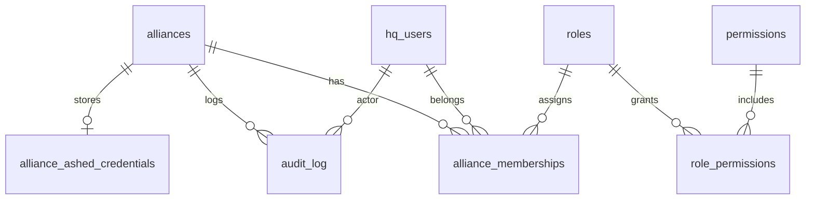

# Multi-tenant schema design

Design-only document for Phase 1 implementation. Extends the current single-session model in [`src/lib/db/schema.ts`](../src/lib/db/schema.ts).

## Goals

- **Many alliances** on one Alliance HQ deployment
- **One shared Ashed seat token per alliance** (encrypted at rest)
- **Many HQ users per alliance** with RBAC finer than Ashed's 3-seat limit
- Session stores HQ identity + current alliance context — **never** the Ashed JWT

## Migration from today

| Today | Target |
|-------|--------|
| `sessions` + `ashed_credentials` (1:1, per browser session) | `hq_users` + `alliances` + `alliance_ashed_credentials` (1 token per alliance) |
| Connect flow stores token on session | Connect flow restricted to `alliance:admin`; token stored on alliance |
| `video_jobs.session_id` | `video_jobs.alliance_id` + `video_jobs.hq_user_id` |

Existing tables remain during migration; new tables are additive until cutover.

## Entity relationship



## Tables

### `alliances`

Alliance tenant root.

| Column | Type | Notes |
|--------|------|-------|
| `id` | `text` PK | nanoid |
| `slug` | `text` UNIQUE | URL-safe identifier, e.g. `my-alliance` |
| `name` | `text` | Display name |
| `created_at` | `timestamptz` | |
| `updated_at` | `timestamptz` | |

### `hq_users`

Identity in Alliance HQ (not the same as Ashed `User/me`).

| Column | Type | Notes |
|--------|------|-------|
| `id` | `text` PK | nanoid |
| `email` | `text` UNIQUE | Login identifier (future auth provider) |
| `display_name` | `text` | |
| `created_at` | `timestamptz` | |
| `updated_at` | `timestamptz` | |

### `alliance_memberships`

Links HQ users to alliances with a role.

| Column | Type | Notes |
|--------|------|-------|
| `id` | `text` PK | |
| `alliance_id` | `text` FK → `alliances.id` | |
| `hq_user_id` | `text` FK → `hq_users.id` | |
| `role_id` | `text` FK → `roles.id` | |
| `status` | `text` | `active`, `invited`, `suspended` |
| `created_at` | `timestamptz` | |
| UNIQUE | `(alliance_id, hq_user_id)` | One membership per user per alliance |

### `roles`

Per-alliance custom roles or global templates.

| Column | Type | Notes |
|--------|------|-------|
| `id` | `text` PK | |
| `alliance_id` | `text` FK nullable | `null` = global template (`owner`, `officer`, …) |
| `name` | `text` | e.g. `owner`, `officer`, `data_entry`, `viewer` |
| `description` | `text` | |
| `is_system` | `boolean` | Template roles cannot be deleted |
| UNIQUE | `(alliance_id, name)` | |

### `permissions`

Granular permission strings (global catalog).

| Column | Type | Notes |
|--------|------|-------|
| `id` | `text` PK | e.g. `members:read` |
| `description` | `text` | |

Seed from [`docs/ashed-api-catalog.json`](./ashed-api-catalog.json) → `rbac.permissions`.

### `role_permissions`

Many-to-many join.

| Column | Type | Notes |
|--------|------|-------|
| `role_id` | `text` FK → `roles.id` | |
| `permission_id` | `text` FK → `permissions.id` | |
| PRIMARY KEY | `(role_id, permission_id)` | |

### `alliance_ashed_credentials`

**One row per alliance** — the shared Ashed seat token.

| Column | Type | Notes |
|--------|------|-------|
| `id` | `text` PK | |
| `alliance_id` | `text` FK UNIQUE → `alliances.id` | One credential set per alliance |
| `app_id` | `text` | Base44 app id (`692b7e16a524fdd9dff3332d`) |
| `origin_url` | `text` | e.g. `https://ashed.online` |
| `encrypted_token` | `text` | AES-256-GCM via `TOKEN_ENCRYPTION_KEY` |
| `token_expires_at` | `timestamptz` | From JWT `exp` |
| `expiry_reminder_days` | `integer` | Default 14 |
| `seat_label` | `text` | Optional human label ("Officer seat 1") |
| `connected_by_hq_user_id` | `text` FK → `hq_users.id` | Audit |
| `connected_at` | `timestamptz` | |
| `updated_at` | `timestamptz` | |

### `audit_log`

Immutable log of mutating BFF operations.

| Column | Type | Notes |
|--------|------|-------|
| `id` | `text` PK | |
| `alliance_id` | `text` FK | |
| `hq_user_id` | `text` FK | |
| `action` | `text` | e.g. `entity.update`, `function.bulkDeleteByDate` |
| `resource_type` | `text` | `entity`, `function`, `integration` |
| `resource_name` | `text` | e.g. `Member`, `bulkDeleteByDate` |
| `resource_id` | `text` nullable | Entity record id when applicable |
| `metadata` | `jsonb` nullable | Sanitized request summary (no token) |
| `created_at` | `timestamptz` | |

### Session changes

Extend `sessions` (or replace with auth provider session):

| Column | Type | Notes |
|--------|------|-------|
| `hq_user_id` | `text` FK → `hq_users.id` | Required after Phase 1 |
| `current_alliance_id` | `text` FK → `alliances.id` nullable | Alliance picker selection |

Remove `ashed_credentials.session_id` FK after migration; drop `ashed_credentials` table when unused.

## Indexes (recommended)

- `alliance_memberships (hq_user_id, status)` — list user's alliances
- `audit_log (alliance_id, created_at DESC)` — alliance audit trail
- `alliances (slug)` — BFF route resolution

## Drizzle sketch (not migrated yet)

```typescript
export const alliances = pgTable("alliances", {
  id: text("id").primaryKey(),
  slug: text("slug").notNull().unique(),
  name: text("name").notNull(),
  createdAt: timestamp("created_at", { withTimezone: true }).defaultNow().notNull(),
  updatedAt: timestamp("updated_at", { withTimezone: true }).defaultNow().notNull(),
});

export const allianceAshedCredentials = pgTable("alliance_ashed_credentials", {
  id: text("id").primaryKey(),
  allianceId: text("alliance_id")
    .notNull()
    .unique()
    .references(() => alliances.id, { onDelete: "cascade" }),
  appId: text("app_id").notNull(),
  originUrl: text("origin_url").notNull(),
  encryptedToken: text("encrypted_token").notNull(),
  tokenExpiresAt: timestamp("token_expires_at", { withTimezone: true }),
  expiryReminderDays: integer("expiry_reminder_days").notNull().default(14),
  seatLabel: text("seat_label"),
  connectedByHqUserId: text("connected_by_hq_user_id").references(() => hqUsers.id),
  connectedAt: timestamp("connected_at", { withTimezone: true }),
  updatedAt: timestamp("updated_at", { withTimezone: true }).defaultNow().notNull(),
});
```

## Phase 1 rollout checklist

1. Add tables above via Drizzle migration
2. Seed `permissions` and global `roles` from catalog `rbac.roleTemplates`
3. Alliance picker UI — set `session.current_alliance_id`
4. Move connect flow to alliance scope; require `alliance:admin`
5. Backfill: create default alliance + migrate existing session credentials

See [`bff-spec.md`](./bff-spec.md) for proxy layer and [`ashed-api-catalog.json`](./ashed-api-catalog.json) for RBAC operation mapping.
